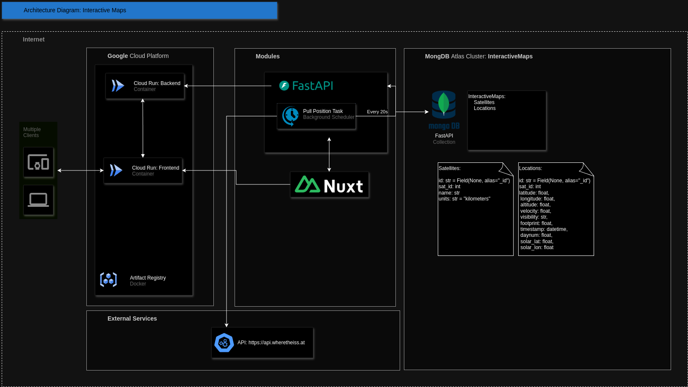

# Full Stack Application - Interactive Maps with FastAPI (Backend) and Nuxt (Frontend)

This README provides instructions for setting up, running, and deploying a full stack application called Interactive Maps using FastAPI for the backend and Nuxt for the frontend. You can run the application using Docker Compose or directly using Makefile commands.


## Prerequisites

Make sure you have the following installed on your system:

- **Python 3.11+** (For the backend)
- **Node.js and npm** (For the frontend)
- **Docker** (For containerization)
- **Docker Compose** (For managing multi-container Docker applications)
- (opt) **Google Cloud SDK** (If deploying to Google Cloud)

## Folder Structure

Here are the most important files within this repo to get you started:

```text
backend/
  ├── app/
  ├── tests/
  ├── .env
  ├── Makefile
  ├── Dockerfile
  ├── app_config.yaml
  ├── requirements.txt
frontend/
  ├── assets/
  ├── components/
  ├── composables/
  ├── layouts/
  ├── pages/
  ├── public/
  ├── server/
  ├── .env
  ├── Makefile
  ├── Dockerfile
  ├── app.vue
  ├── nuxt.config.js
docker-compose.yml
```

---

## Backend Setup (FastAPI)

### 1. Install Python dependencies

Navigate to the `backend` folder and install the required Python packages:

```bash
cd backend
pip install -r requirements.txt
```

### 2. Create the `.env` file

In the `backend` folder, create a `.env` file with the following template:

```env
MONGO_INITDB_DATABASE=<name-of-your-database>
DATABASE_URL=<mongodb-connection-url>
```

Replace `<name-of-your-database>` and `<mongodb-connection-url>` with your actual MongoDB database details.

### 3. Running the Backend

You have two options to run the backend: using Docker Compose or directly using the Makefile.

#### Option 1: Using Docker Compose

1. **Create the `.env` file** in the root folder with the following content:

```env
DATABASE_URL=<mongodb-connection-url>
```

2. **Run Docker Compose**:

```bash
docker-compose build backend 
docker-compose up backend
```

This will build and run the backend container, which will be accessible at `http://172.28.0.2:8080/docs`.

#### Option 2: Without Docker Compose

1. **Run the Backend locally**:

```bash
cd backend
make run
```

The backend will be running locally at `http://localhost:8000/docs`. Running the backend this way will use the `.env` file that is in the `backend` folder. Make sure you configure it properly.

---

## Frontend Setup (Nuxt)

### 1. Install Frontend dependencies

Navigate to the `frontend` folder and install the required npm packages:

```bash
cd frontend
npm install
```

### 2. Create the `.env` file

In the `frontend` folder, create a `.env` file with the following template:

```env
NUXT_API_BASE_URL=<url-for-the-backend>
```

Replace `<url-for-the-backend>` with the URL where your backend is running (e.g., `http://localhost:8000` for local development).

### 3. Running the Frontend

You have two options to run the frontend: using Docker Compose or directly using the Makefile.

#### Option 1: Using Docker Compose

1. **Adjust the NUXT_PUBLIC_API_BASE_URL** in the `docker-compose.yml` file if needed.:

```env
...
NUXT_PUBLIC_API_BASE_URL: http://172.28.0.2:8080/api/
...
```

2. **Run Docker Compose**:

```bash
docker-compose build frontend
docker-compose up frontend
```

This will build and run the frontend container, which will be accessible at `http://172.28.0.3:3000`.

#### Option 2: Without Docker Compose

1. **Run the Frontend locally in development mode**:

```bash
cd frontend
make run-dev
```

The frontend will be available at `http://localhost:3000` for development mode. Running the frontend this way will use the `.env` file that is in the `frontend` folder. Make sure you configure it properly.

---

## Google Cloud Deployments

You can visit the current deployments here:
- Backend: https://inter-maps-backend-974996545024.europe-west1.run.app/docs#
- Frontend: https://inter-maps-frontend-974996545024.europe-west1.run.app/

If you want to deploy the application to Google Cloud, you can use the provided Makefile commands.

### 1. Backend Deployment (Optional)

To deploy the backend to Google Cloud Run, run:

```bash
cd backend
make deploy-gcp-run
```

### 2. Frontend Deployment (Optional)

To deploy the frontend to Google Cloud Run, run:

```bash
cd frontend
make deploy-gcp-run
```

---

## Additional Notes

- Ensure you have the `.env` files in both the `backend` and `frontend` directories properly configured. There are .env.template files already created for you. You can adapt those.
- For Docker Compose, ensure you have the `.env` file in the root directory (for the Docker Compose services).
- For local development, you can choose to run the backend and frontend using Makefile commands or Docker Compose, depending on your preference.
- If you're deploying to Google Cloud, you'll need to set up a GCP project and enable Google Cloud Run.

---

## Troubleshooting

- Ensure that all `.env` files are properly configured with the correct environment variables.
- If encountering issues with Docker or Docker Compose, make sure that Docker and Docker Compose are properly installed and running.
- If you encounter any permission errors while building Docker images, ensure you have the necessary privileges, or run the commands with `sudo` if required.

